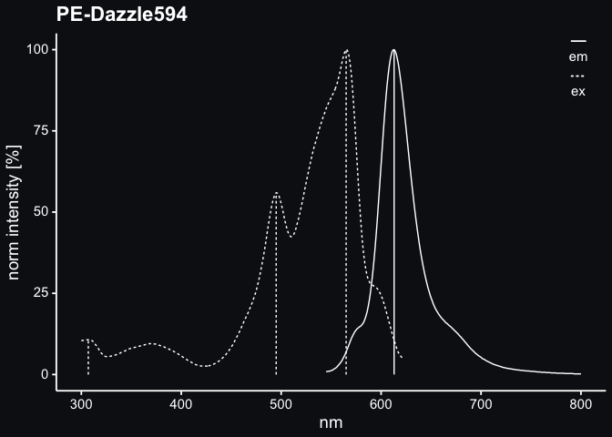

<!-- README.md is generated from README.Rmd. Please edit that file -->

# muchofluo

<!-- badges: start -->
<!-- badges: end -->

A small repository for spectral data of happy little fluorochromes.

<!-- -->

See plots of excitation and emission spectra in
inst/extdata/spectra_images.

All raw data for those are in inst/extdata/spectra.tsv.gz and
inst/extdata/em_ex_maxima.tsv.

    #> 
    #> 
    #> |fluorochrome |source |  nm|  em|   ex|
    #> |:------------|:------|---:|---:|----:|
    #> |PE-Dazzle594 |th     | 545| 0.9| 81.9|
    #> |PE-Dazzle594 |th     | 546| 0.9| 82.6|
    #> |PE-Dazzle594 |th     | 547| 1.0| 83.3|
    #> |PE-Dazzle594 |th     | 548| 1.0| 84.0|
    #> |PE-Dazzle594 |th     | 549| 1.1| 84.6|
    #> |PE-Dazzle594 |th     | 550| 1.2| 85.2|
    #> |PE-Dazzle594 |th     | 551| 1.3| 85.8|
    #> |PE-Dazzle594 |th     | 552| 1.5| 86.5|
    #> |PE-Dazzle594 |th     | 553| 1.7| 87.1|
    #> |PE-Dazzle594 |th     | 554| 1.9| 87.9|
    #> 
    #> 
    #> |fluorochrome |type |  nm| norm_intensity|source | num|
    #> |:------------|:----|---:|--------------:|:------|---:|
    #> |PE-Dazzle594 |em   | 613|            100|th     |   1|
    #> |PE-Dazzle594 |ex   | 307|             11|th     |   1|
    #> |PE-Dazzle594 |ex   | 495|             56|th     |   2|
    #> |PE-Dazzle594 |ex   | 565|            100|th     |   3|

Peaks were detected by algorithm. This may either be oversensitive and
detect too many of them or miss some. Plots were checked and only very
few minor peaks are not detected. In very few spectra lowest emission
peak is below lowest excitation which should not be according to [Stokes
shift](https://en.wikipedia.org/wiki/Stokes_shift).
inst/extdata/fluos.tsv is a table of all fluorochromes with some
accessory info.
