<!-- README.md is generated from README.Rmd. Please edit that file -->

# muchofluo

<!-- badges: start -->

<!-- badges: end -->

A small repository for spectral data of happy little fluorochromes.

Install packages manually before use: pak::pak(‘close-your-eyes/colrr’)
pak::pak(‘close-your-eyes/brathering’)

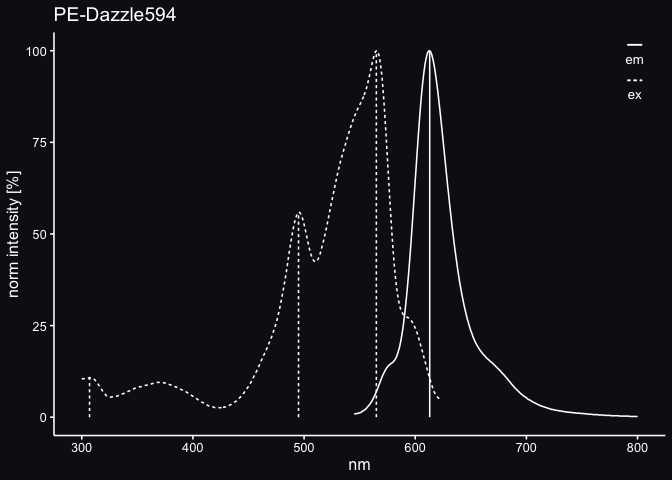<!-- -->

See plots of excitation and emission spectra in
inst/extdata/spectra_images.

All raw data for those are in inst/extdata/spectra.tsv.gz and
inst/extdata/em_ex_maxima.tsv.

    #> 
    #> 
    #> |fluorochrome |source |  nm|  em|   ex|
    #> |:------------|:------|---:|---:|----:|
    #> |PE-Dazzle594 |th     | 545| 0.9| 81.9|
    #> |PE-Dazzle594 |th     | 546| 0.9| 82.6|
    #> |PE-Dazzle594 |th     | 547| 1.0| 83.3|
    #> |PE-Dazzle594 |th     | 548| 1.0| 84.0|
    #> |PE-Dazzle594 |th     | 549| 1.1| 84.6|
    #> |PE-Dazzle594 |th     | 550| 1.2| 85.2|
    #> |PE-Dazzle594 |th     | 551| 1.3| 85.8|
    #> |PE-Dazzle594 |th     | 552| 1.5| 86.5|
    #> |PE-Dazzle594 |th     | 553| 1.7| 87.1|
    #> |PE-Dazzle594 |th     | 554| 1.9| 87.9|
    #> 
    #> 
    #> |fluorochrome |type |  nm| norm_intensity|source | num|
    #> |:------------|:----|---:|--------------:|:------|---:|
    #> |PE-Dazzle594 |em   | 613|            100|th     |   1|
    #> |PE-Dazzle594 |ex   | 307|             11|th     |   1|
    #> |PE-Dazzle594 |ex   | 495|             56|th     |   2|
    #> |PE-Dazzle594 |ex   | 565|            100|th     |   3|

Peaks were detected by algorithm. This may either be oversensitive and
detect too many of them or miss some. Plots were checked and only very
few minor peaks are not detected. In very few spectra lowest emission
peak is below lowest excitation which should not be according to [Stokes
shift](https://en.wikipedia.org/wiki/Stokes_shift).
inst/extdata/fluos.tsv is a table of all fluorochromes with some
accessory info.

# Function to plot spectra

``` r
library(muchofluo)
# select fluorochromes to be plotted together
data <- get_spectral_data(fluos = c("FITC", "PE-cy7"))
# default plot; color histograms by maximum wavelength (em or ex)
plot_spectra(data$bd)[[1]]
```

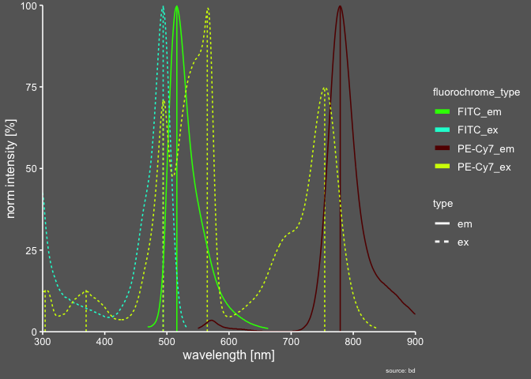<!-- -->

``` r
# points, no lines
plot_spectra(data$bd, geoms = "point")[[1]]
#> Warning: Duplicated `override.aes` is ignored.
```

<!-- -->

``` r
# omit vertical max lines
plot_spectra(data$bd, geoms = "point", plot_max = F)[[1]]
```

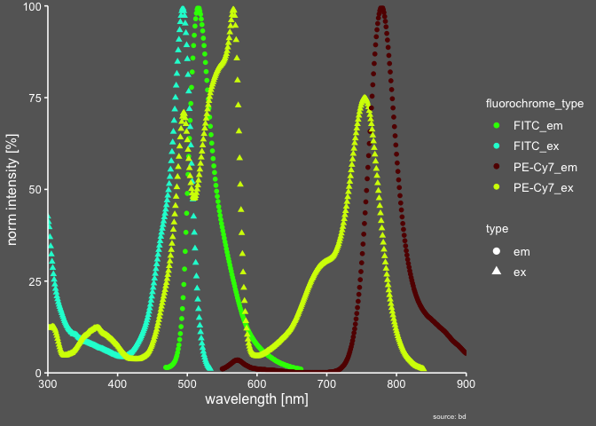<!-- -->

``` r
# points and lines
plot_spectra(data$bd, geoms = c("point", "line"), plot_max = F)[[1]]
#> Warning: Duplicated `override.aes` is ignored.
```

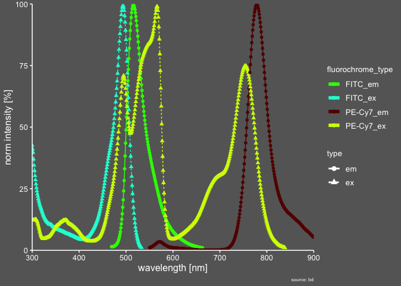<!-- -->

``` r
# color each segment by respective wavelength
plot_spectra(spec_data = data$bd, col_pal = "wavelength", geoms = c("point", "line"), plot_max = F)[[1]]
```

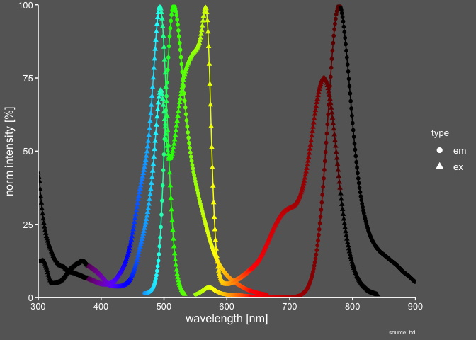<!-- -->

``` r
# add shade fill according to max wavelength
plot_spectra(spec_data = data$bd, col_pal = "wavelength_max", shade_type = "ex")[[1]]
```

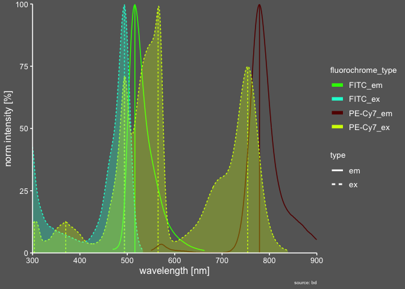<!-- -->

``` r
plot_spectra(spec_data = data$bd, col_pal = "wavelength_max", shade_type = c("ex", "em"))[[1]]
```

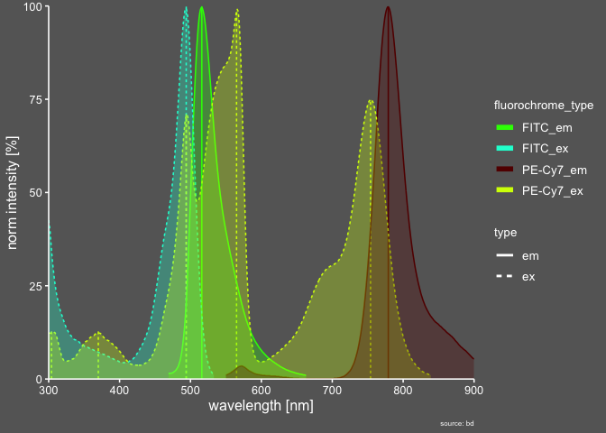<!-- -->

``` r
# add shade fill according to exact wavelength
plot_spectra(spec_data = data$bd, col_pal = "wavelength", shade_type = "ex")[[1]]
```

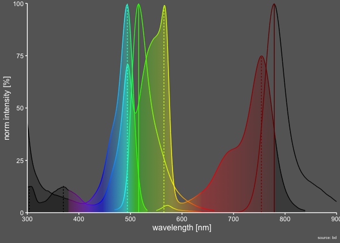<!-- -->

``` r
# use custom coloring
plot_spectra(data$bd, col_pal = "hue")[[1]]
```

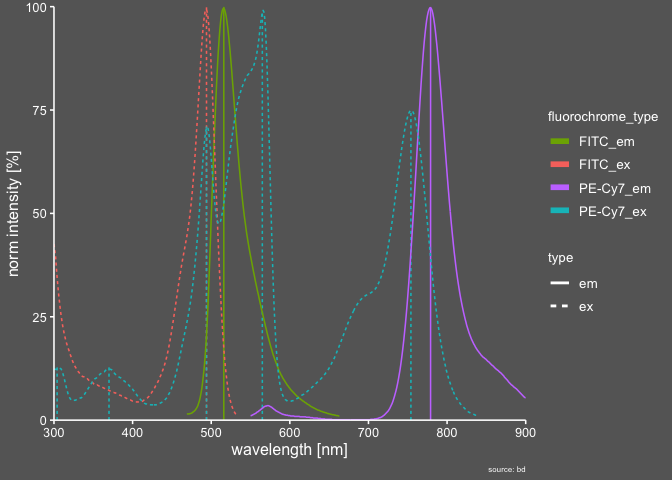<!-- -->

``` r
plot_spectra(data$bd, col_pal = "custom")[[1]]
```

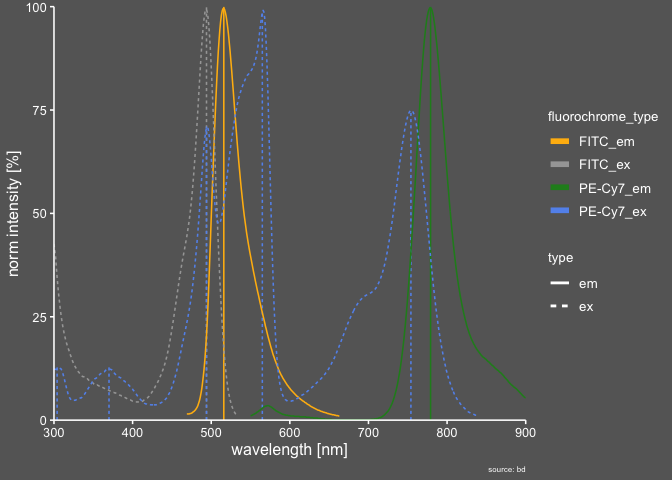<!-- -->

``` r
plot_spectra(data$bd, col_pal = c("hotpink", "firebrick", "forestgreen", "blue"))[[1]]
```

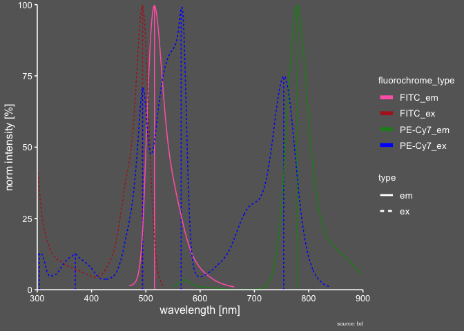<!-- -->

``` r
# plot all local maxima as legend
plot_spectra(data$bd, col_pal = "wavelength_localmax")[[1]]
```

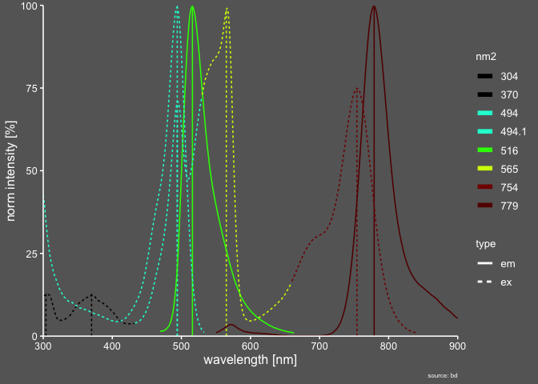<!-- -->
